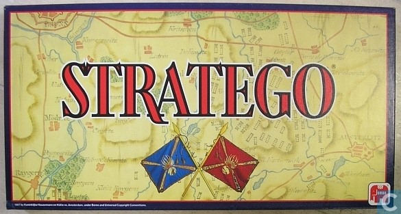
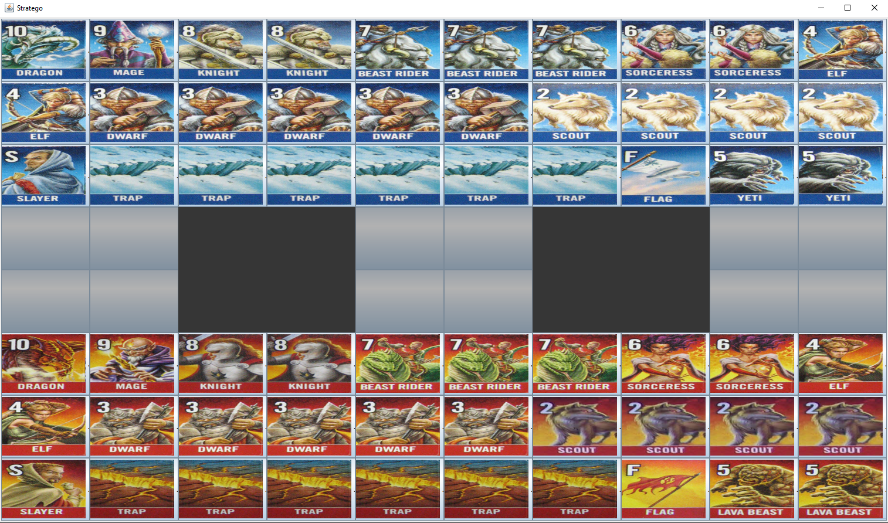

<div id="top"></div>

<!-- PROJECT LOGO -->
<br />
<div align="center">
  
  <h3 align="center">Stratego - Board Game</h3>
</div>


<!-- TABLE OF CONTENTS -->
<!-- <details>
  <summary>Table of Contents</summary>
  <ol>
    <li>
      <a href="#about-the-project">About The Project</a>
      <ul>
        <li><a href="#built-with">Built With</a></li>
      </ul>
    </li>
    <li>
      <a href="#getting-started">Getting Started</a>
      <ul>
        <li><a href="#prerequisites">Prerequisites</a></li>
        <li><a href="#installation">Installation</a></li>
      </ul>
    </li>
    <li><a href="#usage">Usage</a></li>
    <li><a href="#contact">Contact</a></li>
    <li><a href="#acknowledgments">Acknowledgments</a></li>
  </ol>
</details> -->


<!-- ABOUT THE PROJECT -->
## About The Project

This is a small project I did back in 2015 during an undergraduate course. It represents the game of <strong>Stratego</strong>, a well-kwown board strategy game.
The target of the project was to get in touch with <strong>MVC</strong>, a design pattern that stands for Model-View-Controller and is used to separate application's concerns. In more detail:

* <strong>Model</strong> represents an object carrying data. It can also have logic to update controller if its data changes.
  
* <strong>View</strong> represents the visualization of the data that model contains.
  
* <strong>Controller</strong> acts on both model and view. It controls the data flow into model object and updates the view whenever data changes. It keeps view and model separate.


### Built With :wrench:

* Java 8
* JUnit
* MVC design pattern

<!-- GETTING STARTED -->
## Getting Started

To get a local copy up and running follow these simple steps.

### Prerequisites :clipboard:

* Java 8
* JUnit

### Installation :computer:

Follow the steps below to run the project:

1. Clone the repo
   ```sh
   git clone https://github.com/nickkard/Stratego-Game.git
   ```
<!--2. Make sure Java is installed on your pc
    * Open terminal an run the command ```java -version``` (for Windows) or ```java --version``` (for Linux)-->
   
2. Import the project in your favorite IDE
    * For <strong>IntelliJ</strong> : <strong>File :arrow_right:  New :arrow_right: Project From Existing Sources... </strong>
  
3. Install required packages
    * Most likely <strong>JUnit</strong> which can be done via the IDE
  
4. Run the project :star:
  
A new window appears presenting the board of the game, just like the image below:
  
<div align="center">
  
  <h4 align="center">Screenshot of the board</h4>
</div>


<!-- USAGE EXAMPLES -->
## Usage

The game is played by two players (Volcandria :fire: and Everwinter :snowflake:) in turns. Each player has 30 cards available which are seperated in 3 categories:
* Static cards (Cannot move or attack)
    * :fire: :snowflake: Trap :arrow_right: eliminates every moving card except Dwarf
    * :fire: :snowflake: Flag :arrow_right: game ends if flag is captured
* Moving cards (Can move and attack)
    * :fire: :snowflake: Mage
    * :fire: :snowflake: Knight
    * :fire: :snowflake: Beast Rider
    * :fire: :snowflake: Sorceress
    * :fire: :snowflake: Elf
    * :fire: :snowflake: Scout
    * :snowflake: Yeti
    * :fire: Lava Beast
    
* Special moving cards
    * :fire: :snowflake: Dwarf :arrow_right: eliminates Trap
    * :fire: :snowflake:: Slayer :arrow_right: eliminates Dragon  

The rank :muscle: of each moving card is represented with a number on top of it. Slayer's rank is represented by 'S', which is the highest.

The board (see image below) presents the two teams, as well as their corresonding cards (Volcandria at the top and Everwinter at the bottom).

A player can move a (moving) card in each of the four directions at an empty or occupied slot. In case of the latter, the more powerful card will eliminate the other. In case the two cards have equal ranks, both are eliminated. <strong>Note</strong> that the two black squares in the middle rows of the board are prohibited and a move there is not allowed. :no_entry: 

### Ressurection :recycle:

Each player has <strong>two</strong> available ressurections throughout the game. The rules to perform a ressurection are:
* The player is attacking
* The attacker's card wins the fight
* The attacker's card is <strong>not</strong> a Scout
* The defender's card is located at the far back side of the board, i.e.
  * For Volcandria's attack: defender's card located at top line of the board
  * For Everwinter's attack: defender's card located at bottom line of the board
* The two ressurections cannot be performed by the same card
* The attacker has at least one card defeated - taken out of the board

In case the ressurection conditions are met, the last defeated card of the attacker is added to the board.

### Gave Over :trophy:

The game ends when:
* A player captures the :triangular_flag_on_post: of the enemy team, or
* A player has no available moves


<!-- CONTACT -->
## Contact

:sunglasses: [nickkard](https://github.com/nickkard) :email: krnikos@gmail.com

Project :link: [https://github.com/nickkard/Stratego-Game.git](https://github.com/nickkard/Stratego-Game.git)


<!-- 
Based on the tamplate: https://github.com/othneildrew/Best-README-Template
GitHub Emoji Cheat Sheet : https://www.webpagefx.com/tools/emoji-cheat-sheet
-->
